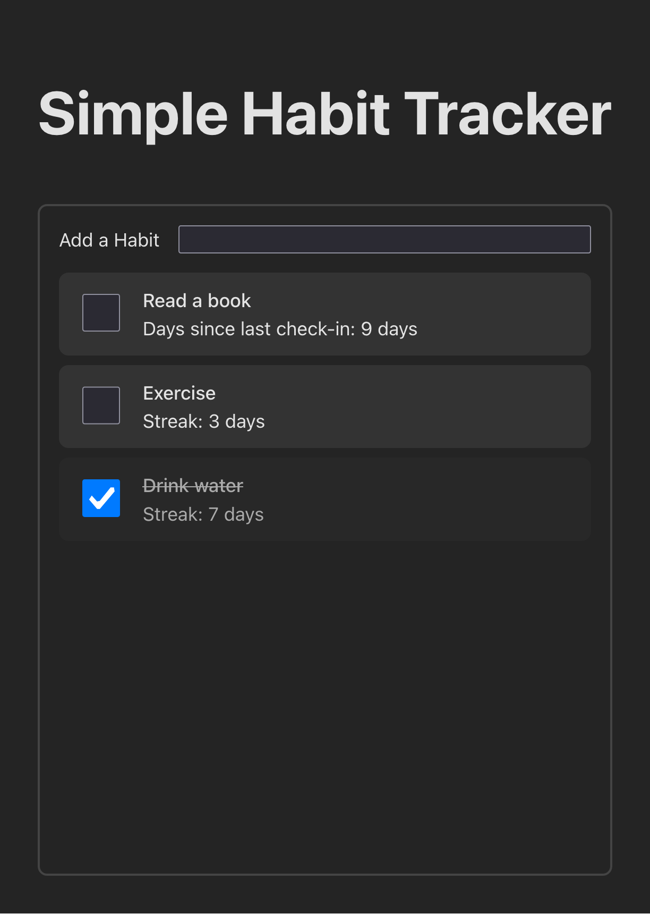

## Backend

### Running locally

## Frontend



### Running locally

Ensure you have node.js and npm installed, then run:

```
cd frontend
npm install
npm run dev
```

The app should load at http://localhost:5173

### Browser compatibility

The base app has been tested on the latest versions of Firefox and Chrome.
Styling might not work on e.g. older versions of Safari, due to the use of the
new [CSS nesting](https://developer.mozilla.org/en-US/docs/Web/CSS/CSS_nesting)
feature.

For date calculations (number of days since last check in), the cutting-edge
[Temporal
API](https://developer.mozilla.org/en-US/docs/Web/JavaScript/Reference/Global_Objects/Temporal)
was used (for fun and experimentation), which as of the time of writing, is only
supported in Firefox (v139+). For production, we could use a polyfill, an
existing npm library, or simply write the date comparison function ourselves.
